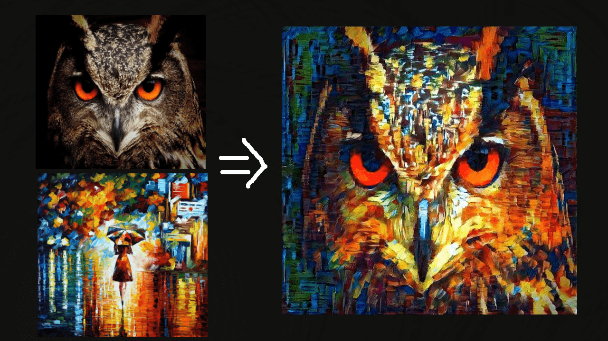
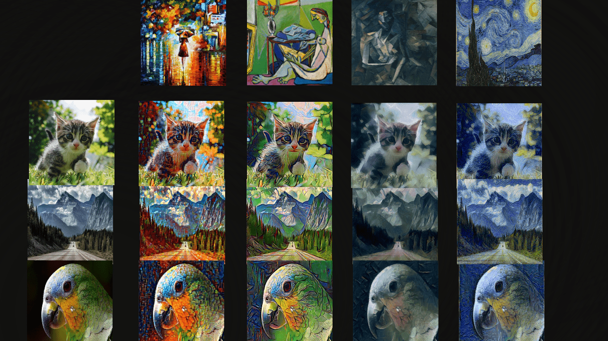
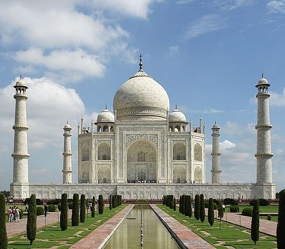
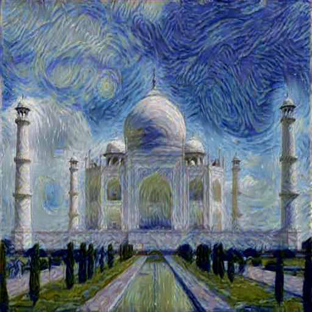
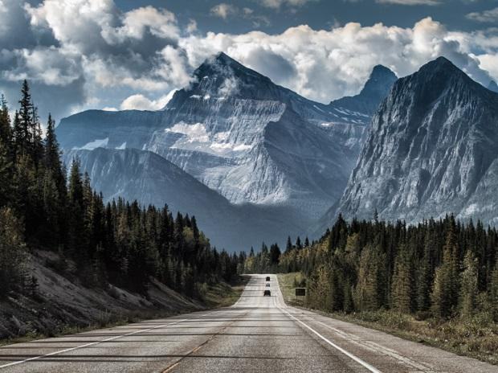
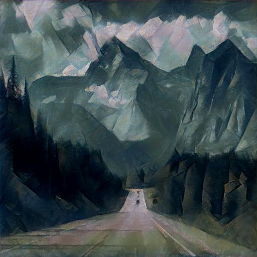
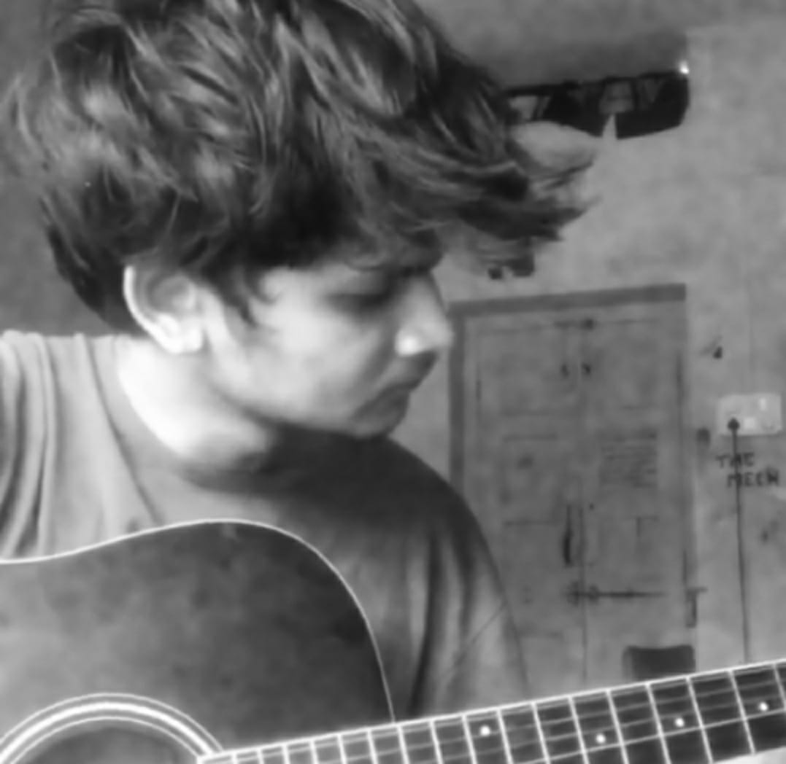
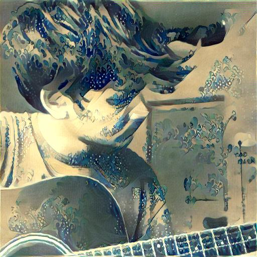

# Neural Style Transfer in Pytorch

Artistic style transfer using pytorch.
Recreate images into style of other images(painting)

This implementation is based on "A Neural Algorithm of Artistic Style":
Paper: https://arxiv.org/pdf/1508.06576.pdf   

This implementation uses VGG19 instead of VGG16

run `python main.py`  
**Note:** Images will be save after 200 iterations in out folder.

### Cola
Simplest Way to run: 
 

## More Style Transfer

 
 

### The Stary Night & Taj Mahal

  
  

 
  

### Seated Nude & Mountains

 
 

 
  

### The Great Wave off Kanagawa & Me

  
  

 